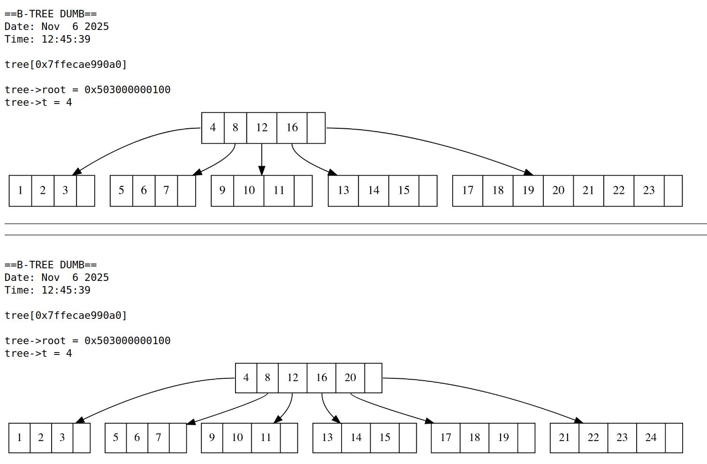

Попов Владимир Сергеевич, Б01-411, 2 курс ИВТ ФРКТ МФТИ

# Алгосы

Это репозиторий с учебными задачами по алгосам 3 и 4 семестра. Все задачи запускаются через make.

Интеренсые экземпляры

Путь | Что там
---- | ----
b_tree | B-дерево на Си с визуальным дампом при помощи graphviz 
technic/avl | АВЛ-дерево на Си
technic/кфвшч | RADIX-sort на Си
technic/rbt | КЧД на Си
technic/binomheap | Биномиальная куча на Си
mo | Доклад по алгоритму Mо
4/B | Реализация ориентированного и неориентированного графа с кеширование (поиск мостов, точек сочленения, топологическая сортировка, конденсация)